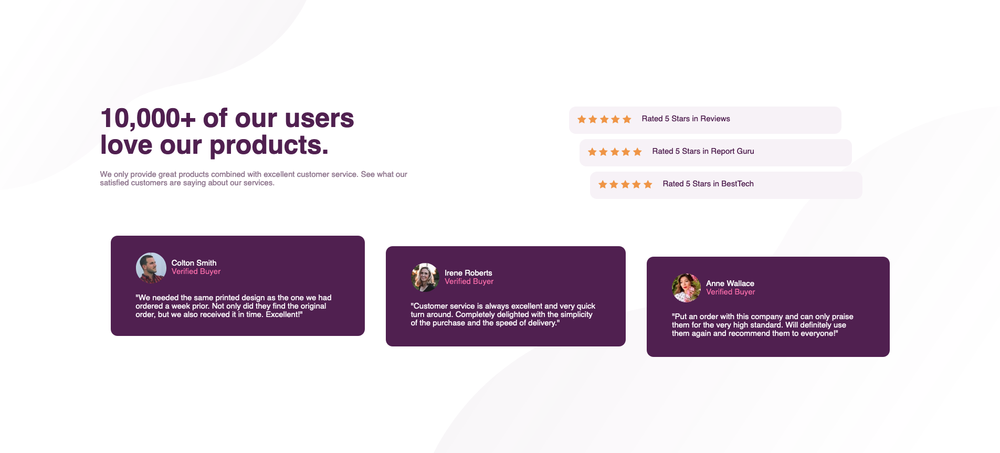

# Frontend Mentor - Social proof section solution

This is a solution to the [Social proof section challenge on Frontend Mentor](https://www.frontendmentor.io/challenges/social-proof-section-6e0qTv_bA). Frontend Mentor challenges help you improve your coding skills by building realistic projects. 

## Table of contents

- [Overview](#overview)
  - [The challenge](#the-challenge)
  - [Screenshot](#screenshot)
  - [Links](#links)
- [My process](#my-process)
  - [Built with](#built-with)
  - [What I learned](#what-i-learned)
  - [Useful resources](#useful-resources)
- [Author](#author)

**Note: Delete this note and update the table of contents based on what sections you keep.**

## Overview

### The challenge

Users should be able to:

- View the optimal layout for the section depending on their device's screen size

### Screenshot




### Links

- [Live Site URL](https://social-proof-section-smb.netlify.app/)

## My process

### Built with

- Semantic HTML5 markup
- Flexbox
- CSS Grid
- Mobile-first workflow

### What I learned

I used css grid for the layout on desktop. This was new to me and I implemented it in the following css code. 

```css
    .container {
        width: 80%;
        display: grid;
        grid-template-columns: 1fr 1fr 1fr 1fr;
        grid-template-areas:
        "hero hero stars stars"
        "review review review review";
        grid-gap: 40px;
    }
```


### Useful resources

- [CSS Tricks](https://css-tricks.com/snippets/css/complete-guide-grid/) - I used CSS Grid in a challenge for the first time and this article helped me a lot with understanding concepts like Grid-gap and template areas. 


## Author

- Frontend Mentor - [@SanjayB06](https://www.frontendmentor.io/profile/SanjayB06)


